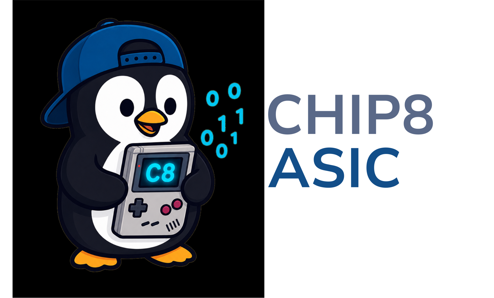

<!--
SPDX-FileCopyrightText: 2026 Rafael V. Volkmer <rafael.v.volkmer@gmail.com>
SPDX-License-Identifier: GPL-3.0-only
-->

---

<div align="center">

  [![Contributors][contributors-shield]][contributors-url]
  [![Forks][forks-shield]][forks-url]
  [![Stargazers][stars-shield]][stars-url]
  [![Issues][issues-shield]][issues-url]
  [![License][license-shield]][license-url]
</div>

---

<p align="center">
  
</p>

<p align="center">
  A synthesizable CHIP-8 console SoC for FPGA boards, ASIC-oriented RTL checks,
  formal verification, Rust reference validation, and board bring-up flows.
</p>

<div align="center">

  Rafael V. Volkmer ·
  rafael.v.volkmer@gmail.com

</div>

---

## Status

> [!IMPORTANT]
> This project is an active hardware and validation workbench. The core RTL,
> Rust validation engine, CI checks, board wrappers, and documentation are kept
> aligned, but board timing closure and ASIC physical implementation are still
> integration tasks for the selected target flow.

---

## Overview

`chip-8-console-fpga` implements a CHIP-8 console as a modular SystemVerilog
SoC. The repository contains the CPU core, memory path, video pipeline, keypad
interfaces, timers, ROM loading, SD/SPI boot support, debug/DAP logic, CDC
helpers, board wrappers, formal targets, Verilator simulations, Yosys checks,
and a Rust validation engine used as an executable reference model.

The RTL follows [VerilogCodingStyle.md](VerilogCodingStyle.md), and the
validation code follows [DVCodingStyle.md](DVCodingStyle.md). These repository
copies track the lowRISC SystemVerilog and DV style guides with project-local
GPL-3.0-only headers and CHIP-8 module documentation. The practical rules used
here include two-space indentation, ANSI module declarations, `logic`-based
SystemVerilog, explicit port connections, `always_ff`/`always_comb`,
active-low reset suffix `_ni` or `_no`, and input/output suffixes `_i` and
`_o`.

The project is organized around four design goals:

| Area | Goal |
| ---- | ---- |
| Architecture | Keep the CHIP-8 core, SoC peripherals, board wrappers, CDC blocks, and validation layers explicit and reviewable. |
| FPGA portability | Support Gowin Tang Nano 9K, Intel Cyclone V, and Xilinx Artix-7 integration paths without hiding vendor-specific constraints. |
| ASIC readiness | Preserve synthesizable RTL, Yosys netlist checks, formal contracts, reset discipline, CDC documentation, and reproducible validation artifacts. |
| Verification | Combine Rust reference tests, C FFI smoke tests, Verilator simulations, SymbiYosys formal checks, syntax/synthesis checks, and repository hygiene gates. |

---

## CHIP-8 Context

CHIP-8 was created by RCA engineer Joseph Weisbecker for early RCA COSMAC 1802
systems such as the COSMAC VIP. It is commonly described as an emulator target,
but technically it is a small interpreted virtual machine: programs are stored
as two-byte opcodes, the display is monochrome, input uses a 16-key hexadecimal
keypad, and timers tick at 60 Hz. That compact machine model is why CHIP-8
remains a useful first emulator target and also a practical hardware education
target.

This RTL treats CHIP-8 as a hardware console workload rather than a software
interpreter. The ISA is implemented as synthesizable datapath/control blocks,
the framebuffer is real RTL storage, and board wrappers provide clocks, reset,
video, keypad, debug, and ROM ingress surfaces.

Useful CHIP-8 references and simulators:

| Resource | Use |
| -------- | --- |
| [Octo](https://johnearnest.github.io/Octo/) | Online CHIP-8 IDE, assembler, emulator, and program playground. |
| [Silicon8](https://timendus.github.io/silicon8/) | Browser CHIP-8 emulator useful for quick ROM behavior comparison. |
| [Tobias Langhoff CHIP-8 guide](https://tobiasvl.github.io/blog/write-a-chip-8-emulator/) | Historical and behavioral guide for CHIP-8 components and opcode edge cases. |
| [Cowgod technical reference](http://devernay.free.fr/hacks/chip8/C8TECH10.HTM) | Classic opcode and machine reference, useful with known errata awareness. |
| [Awesome CHIP-8 links](https://chip-8.github.io/links/) | Curated list of interpreters, documentation, tests, and tools. |
| [COSMAC VIP background](https://en.wikipedia.org/wiki/COSMAC_VIP) | Historical context for the original 1977 RCA microcomputer family. |
| [CHIP-8 background](https://en.wikipedia.org/wiki/CHIP-8) | High-level history of the interpreted language and later variants. |

---

## Repository Stats

| Metric | Badge | Meaning |
| ------ | ----- | ------- |
| Repository size | [![Repo Size][repo-size-shield]][repo-size-url] | Total repository size reported by GitHub. |
| Code size | [![Code Size][code-size-shield]][code-size-url] | Source-code size reported by GitHub Linguist. |
| Top language | [![Top Language][top-language-shield]][top-language-url] | Dominant language detected in the repository. |

---

## Repository Tree

```text
.
├── .github/workflows/          # Separate CI pipelines for docs, RTL, Rust, shell, YAML, TOML, links, and REUSE
├── constraints/                # Board constraints for Gowin, Intel Quartus, and Xilinx Vivado flows
├── docs/                       # Architecture, verification, register, block, ISA, and technical notes
├── readme/images/              # README artwork and project identity assets
├── rtl/
│   ├── boards/                 # Board-level wrappers for Tang Nano 9K, Cyclone V, Artix-7, and common USB top logic
│   ├── core/chip8/             # CHIP-8 packages, CPU, memory, video, timers, input, bus, debug, and top modules
│   ├── lib/common/             # Shared CDC, FIFO, reset, CRC, UART, and reduction primitives
│   └── soc/                    # SoC buses, DMA, IRQ, storage, debug, video, keypad, and top-level SoC integration
├── scripts/
│   ├── programming/            # USB DAP ROM loading and board interaction helpers
│   ├── quality/                # Repository configuration checks
│   ├── simulation/             # Verilator simulation and coverage flows
│   ├── synthesis/              # Yosys, Gowin, Quartus, and Vivado synthesis entry points
│   └── verification/           # Verilator and Yosys lint/synthesis checks
├── validation/
│   ├── ffi/                    # C-to-Rust FFI smoke tests
│   ├── formal/                 # SymbiYosys proof and cover targets
│   ├── programs/chip8/         # CHIP-8 smoke ROM and validation ROM set
│   ├── rust/                   # Rust validation engine and CHIP-8 reference model
│   └── simulation/             # Verilator testbenches and simulation notes
├── files.f                     # Portable RTL/testbench file list
├── Makefile                    # Local verification, synthesis, programming, and cleanup entry point
├── DVCodingStyle.md            # Project DV and testbench coding standard
└── VerilogCodingStyle.md       # Project SystemVerilog coding standard
```

---

## Documentation

| Document | Content |
| -------- | ------- |
| [Architecture](docs/ARCHITECTURE.md) | Block diagram, memory map, clocks, resets, CDC notes, boot flow and ROM protocol. |
| [Verification](docs/VERIFICATION.md) | Validation matrix, formal targets, Rust model checks, simulation coverage and CI command map. |
| [RTL block catalog](docs/BLOCKS.md) | Source-file responsibilities by layer. |
| [Register map](docs/REG.md) | AXI-Lite page map and MMIO bit definitions. |
| [ISA reference](docs/ISA.md) | Implemented CHIP-8 opcodes and side effects. |
| [Technical notes](docs/TECHNICAL_NOTES.md) | Coding, CDC, reset and process rules with reference material. |
| [Simulation notes](validation/simulation/README.md) | Simulation-specific testbench details. |

---

## Getting Started

Install the core open-source toolchain used by the default local flow:

```sh
sudo apt-get update
sudo apt-get install -y build-essential verilator yosys python3 python3-pip
cargo --version
```

Optional but recommended tools:

```sh
cargo install svlint taplo-cli --locked
python3 -m pip install --user reuse yamllint
```

Clone and run the fast local quality flow:

```sh
git clone https://github.com/RafaelVVolkmer/chip-8-console-fpga.git
cd chip-8-console-fpga
make quick-check
```

Run the complete local pipeline:

```sh
make check
```

Clean generated outputs:

```sh
make clean
```

---

## Build And Validation

Common development commands:

```sh
make lint
make sim
make chip8-sim
make axi-sim
make synthesis-yosys
make formal-syntax
make coverage
```

Rust validation engine:

```sh
make rust-fmt
make rust-check
make rust-clippy
make rust-test
make rust-doc
make rust-release
make rust-validation
```

Repository hygiene checks:

```sh
reuse lint
typos --format brief .
lychee --config .lychee.toml README.md 'docs/**/*.md' validation/simulation/README.md
yamllint .github/workflows .markdownlint.yml .yamllint.yml
actionlint -color
taplo lint .lychee.toml .svlint.toml .typos.toml REUSE.toml validation/rust/Cargo.toml
shellcheck scripts/**/*.sh
shfmt -d -i 4 -ci scripts/**/*.sh
```

---

## FPGA And ASIC-Oriented Flows

The generic ASIC-oriented handoff starts with the synthesizable core and Yosys
checks. This does not produce a placed-and-routed ASIC; it produces auditable
netlist and synthesis artifacts that can feed a downstream ASIC flow:

```sh
make synthesis-yosys
```

Generated outputs are written under `reports/`, including:

```text
reports/chip8_top_synth.json
reports/chip8_top_netlist.v
reports/yosys_synth.log
```

Board-oriented FPGA flows:

| Target | Compile | Program |
| ------ | ------- | ------- |
| Gowin Tang Nano 9K | `make tang-nano-9k-synth` | `make tang-nano-9k-program-sram BITSTREAM=build/tang_nano_9k/impl/pnr/project.fs` |
| Intel Cyclone V | `make board-synth BOARD=cyclone_v` | `make board-program BOARD=cyclone_v BITSTREAM=build/cyclone_v_top_quartus/output_files/cyclone_v_top.sof` |
| Xilinx Artix-7 | `make board-synth BOARD=artix_a7` | `make board-program BOARD=artix_a7 BITSTREAM=build/artix_a7_top/artix_a7_top.bit` |

ROM loading through the USB DAP path:

```sh
make usb-dap-id PORT=/dev/ttyACM1
make usb-dap-load-rom PORT=/dev/ttyACM1 CHIP8_ROM=validation/programs/chip8/smoke.ch8
```

Board constraints live under `constraints/`. Treat the provided files as
integration templates: final pinout, clocks, reset synchronization, video
timing, generated PLLs, and timing closure must match the physical board.

---

## CI Layout

The repository uses one GitHub Actions workflow per gate so failures are easy to
triage:

| Gate | Workflow |
| ---- | -------- |
| REUSE/SPDX | `.github/workflows/reuse.yml` |
| Link checking | `.github/workflows/lychee.yml` |
| Typo checking | `.github/workflows/typos.yml` |
| Markdown lint | `.github/workflows/markdown-lint.yml` |
| TOML lint/format | `.github/workflows/toml-lint.yml` |
| YAML lint | `.github/workflows/yaml-lint.yml` |
| GitHub Actions lint | `.github/workflows/actionlint.yml` |
| Shell lint/format | `.github/workflows/shellcheck.yml`, `.github/workflows/shell-format.yml` |
| Rust checks | `.github/workflows/rust-*.yml` |
| SystemVerilog checks | `.github/workflows/svlint.yml`, `.github/workflows/verilator-*.yml`, `.github/workflows/yosys-*.yml` |

---

[contributors-shield]: https://img.shields.io/github/contributors/RafaelVVolkmer/chip-8-console-fpga.svg?style=flat-square&logo=changedetection&logoColor=white&label=Contributors&labelColor=1F2328&color=2F81F7
[contributors-url]: https://github.com/RafaelVVolkmer/chip-8-console-fpga/graphs/contributors
[forks-shield]: https://img.shields.io/github/forks/RafaelVVolkmer/chip-8-console-fpga.svg?style=flat-square&logo=forgejo&logoColor=white&label=Forks&labelColor=1F2328&color=F78166
[forks-url]: https://github.com/RafaelVVolkmer/chip-8-console-fpga/network/members
[stars-shield]: https://img.shields.io/github/stars/RafaelVVolkmer/chip-8-console-fpga.svg?style=flat-square&logo=riseup&logoColor=white&label=Stars&labelColor=1F2328&color=E3B341
[stars-url]: https://github.com/RafaelVVolkmer/chip-8-console-fpga/stargazers
[issues-shield]: https://img.shields.io/github/issues/RafaelVVolkmer/chip-8-console-fpga.svg?style=flat-square&logo=sentry&logoColor=white&label=Issues&labelColor=1F2328&color=DA3633
[issues-url]: https://github.com/RafaelVVolkmer/chip-8-console-fpga/issues
[license-shield]: https://img.shields.io/github/license/RafaelVVolkmer/chip-8-console-fpga.svg?style=flat-square&logo=libreofficeimpress&logoColor=white&label=License&labelColor=1F2328&color=3FB950
[license-url]: https://github.com/RafaelVVolkmer/chip-8-console-fpga/blob/main/LICENSE

[repo-size-shield]: https://img.shields.io/github/repo-size/RafaelVVolkmer/chip-8-console-fpga?style=flat-square&logo=github&logoColor=white&label=Repo%20size&labelColor=1F2328&color=6E7681
[repo-size-url]: https://github.com/RafaelVVolkmer/chip-8-console-fpga
[code-size-shield]: https://img.shields.io/github/languages/code-size/RafaelVVolkmer/chip-8-console-fpga?style=flat-square&logo=files&logoColor=white&label=Code%20size&labelColor=1F2328&color=6E7681
[code-size-url]: https://github.com/RafaelVVolkmer/chip-8-console-fpga
[top-language-shield]: https://img.shields.io/github/languages/top/RafaelVVolkmer/chip-8-console-fpga?style=flat-square&logo=verilog&logoColor=white&label=Top%20language&labelColor=1F2328&color=A8B9CC
[top-language-url]: https://github.com/RafaelVVolkmer/chip-8-console-fpga
